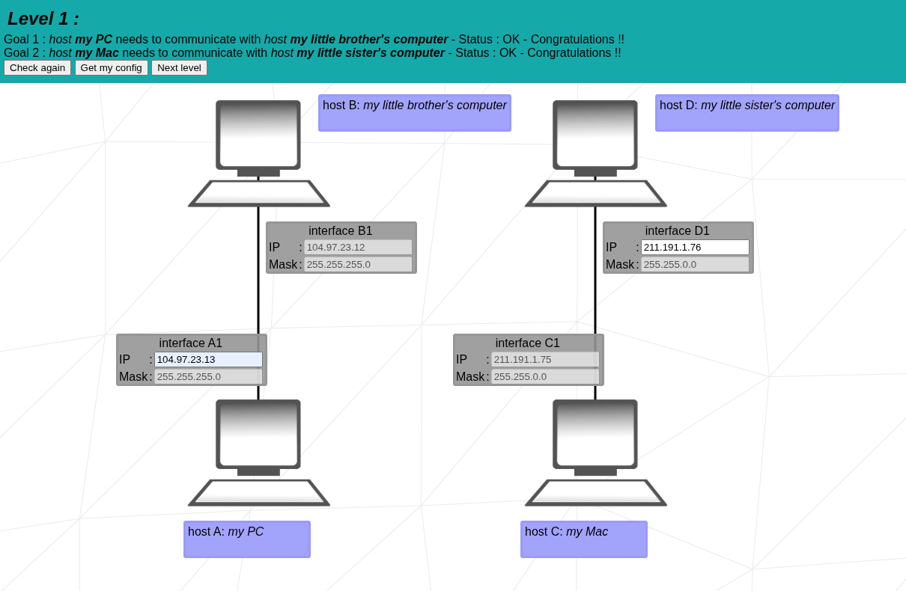
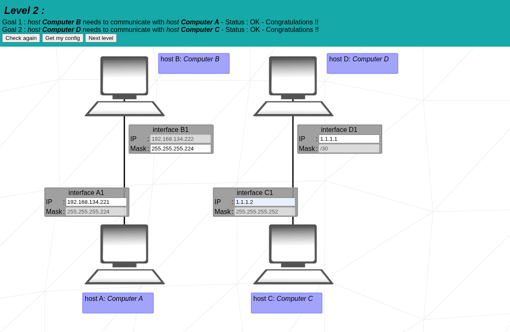
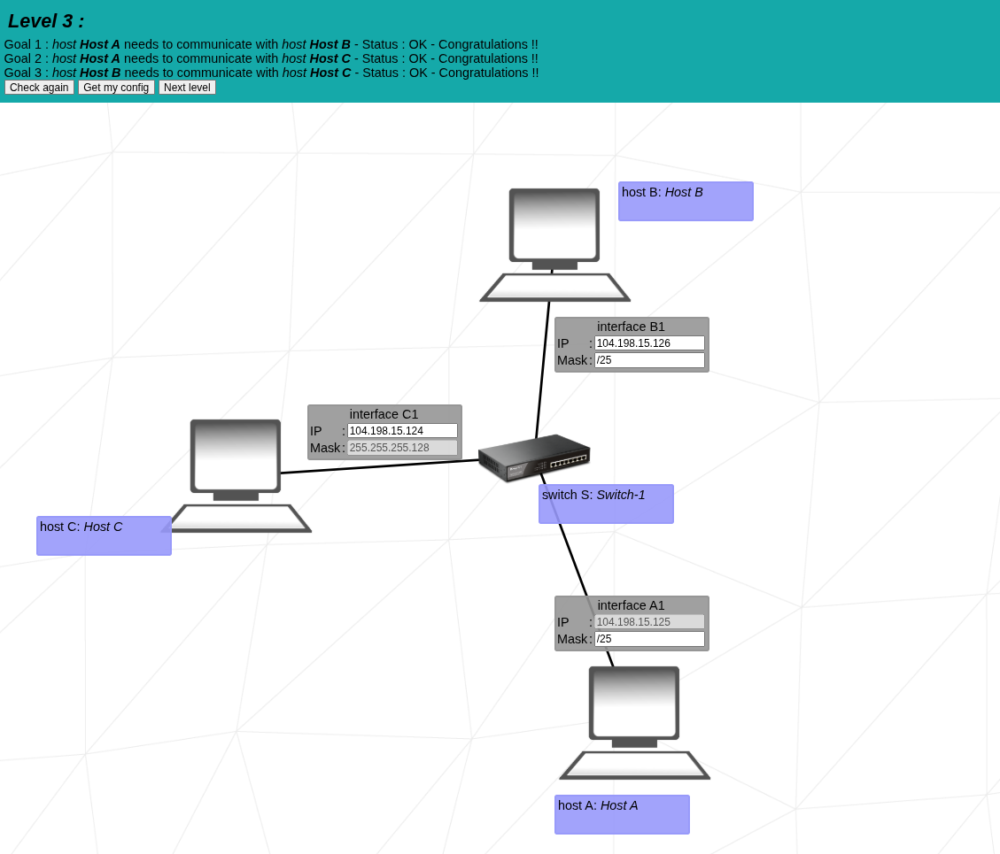
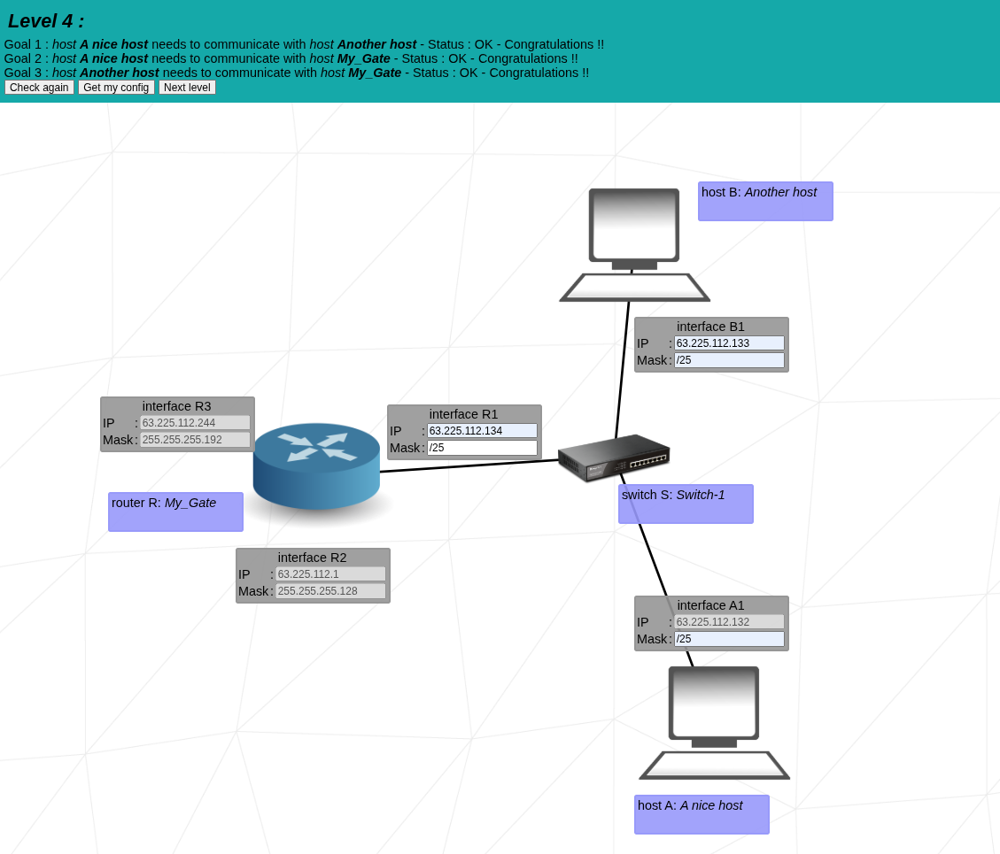
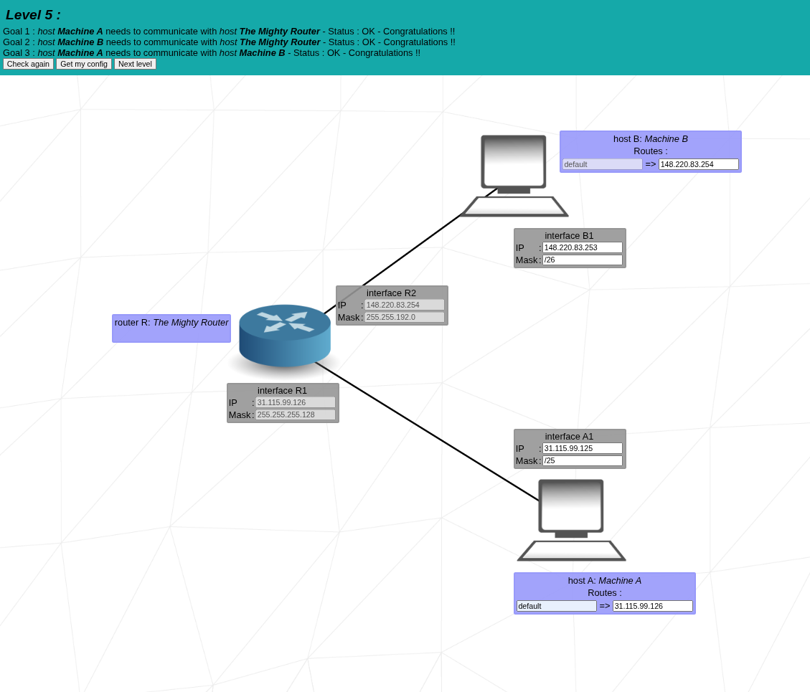
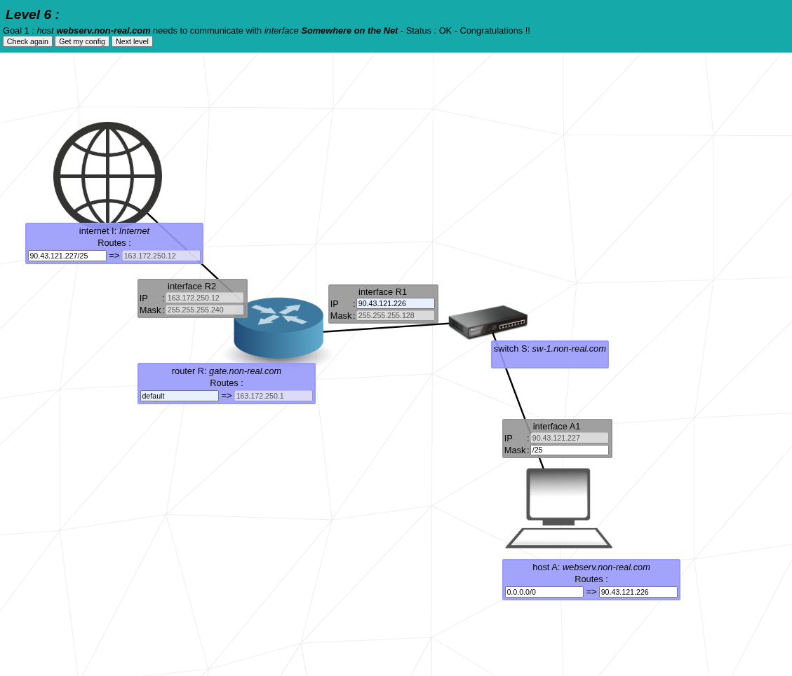
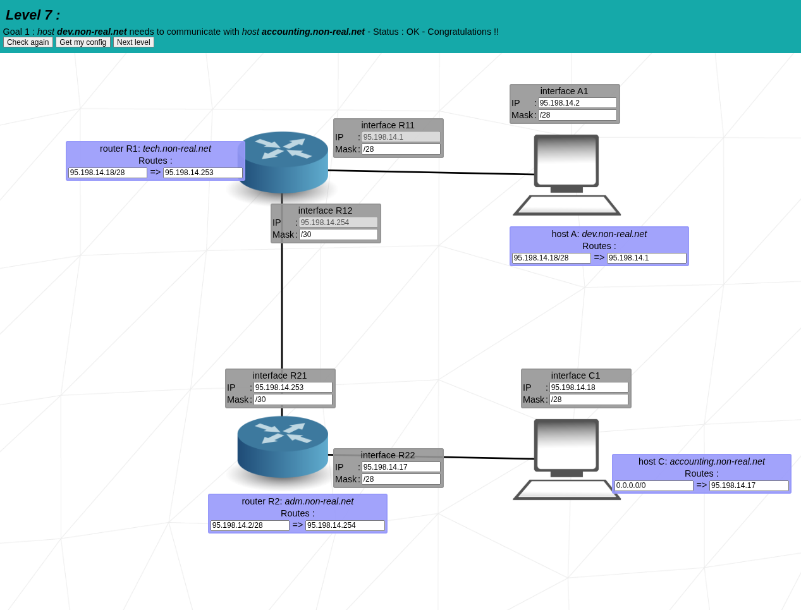
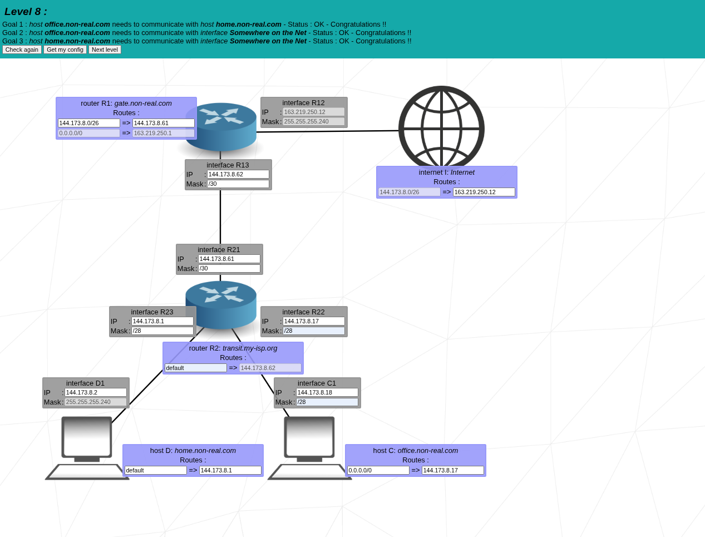
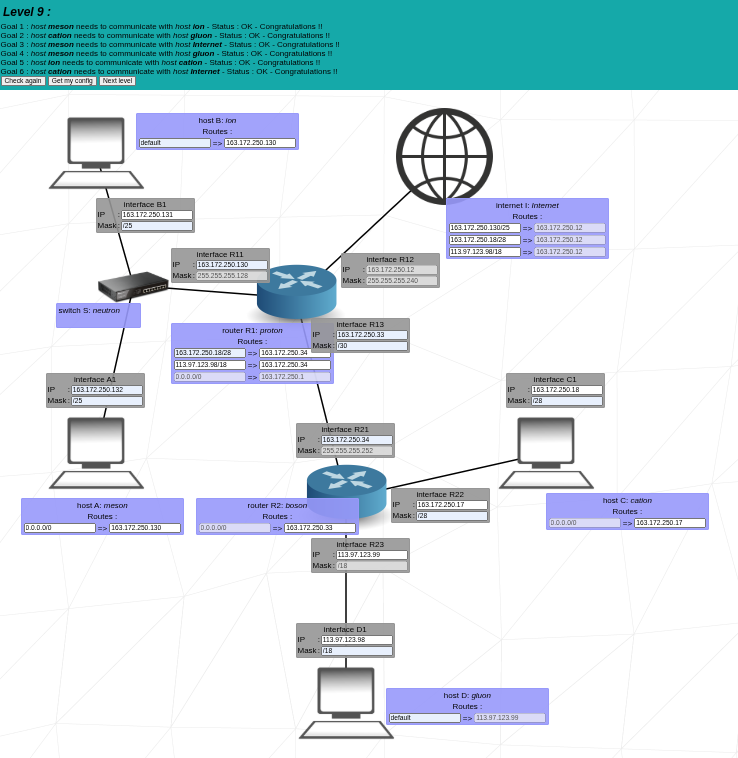
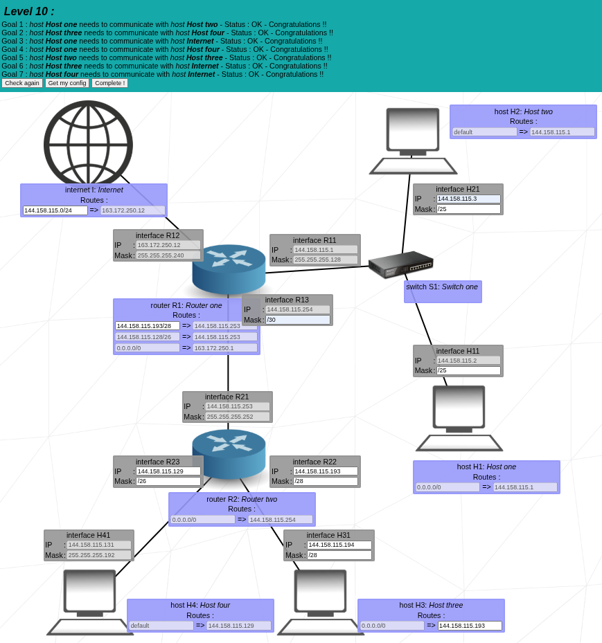

# **NetPractice**

**Summary:** Learn networking basics and how to configure networks step by step with hands-on exercises.

---

## **I. Introduction**

NetPractice is a project designed to teach networking fundamentals by simulating real networks in a browser.
By completing exercises, learners will:

* Understand TCP/IP addressing
* Configure routers, switches, and devices
* Apply DHCP, NAT, routing, and subnetting concepts
* Solve practical network problems

---

## **II. Project Structure & Guidelines**

* **Levels:** 10 exercises (levels) to complete
* **Submission:** Each level → 1 configuration file in Git repository
* **Interface:** Browser-based simulation, open `index.html`
* **Login:** Required for full tracking; can try "correction version" without login
* **Evaluation:** Complete 3 random levels in 15 min during defense

---

## **III. Networking Concepts**

### **1. IP Addressing**

**Classes:**

| Class | Range                     | Default Mask | Hosts      | Use             |
| ----- | ------------------------- | ------------ | ---------- | --------------- |
| A     | 1.0.0.0–126.255.255.255   | /8           | 16 million | Large networks  |
| B     | 128.0.0.0–191.255.255.255 | /16          | 65k        | Medium networks |
| C     | 192.0.0.0–223.255.255.255 | /24          | 254        | Small networks  |

**Private vs Public IPs:**

* **Private:** 10.x.x.x, 172.16–31.x.x, 192.168.x.x → used inside LAN
* **Public:** Any IP outside private range → internet access

---

### **2. Subnetting**

**Purpose:** Divide a network into smaller networks for organization & efficiency.

**Steps:**

1. Decide number of subnets needed
2. Borrow bits from host part of IP
3. Calculate new subnet mask
4. Determine network, broadcast, and usable host addresses

**Example:**

* IP: 192.168.1.0/24 → 4 subnets → borrow 2 bits → /26
* Each subnet hosts: 62 devices

| Subnet | Network Address  | First Host    | Last Host     | Broadcast     |
| ------ | ---------------- | ------------- | ------------- | ------------- |
| 1      | 192.168.1.0/26   | 192.168.1.1   | 192.168.1.62  | 192.168.1.63  |
| 2      | 192.168.1.64/26  | 192.168.1.65  | 192.168.1.126 | 192.168.1.127 |
| 3      | 192.168.1.128/26 | 192.168.1.129 | 192.168.1.190 | 192.168.1.191 |
| 4      | 192.168.1.192/26 | 192.168.1.193 | 192.168.1.254 | 192.168.1.255 |

---

### **3. DHCP (Dynamic Host Configuration Protocol)**

* Automatically assigns IPs to devices
* **Process (DORA):**

  1. **Discover** → Device asks for IP
  2. **Offer** → DHCP server offers IP
  3. **Request** → Device requests offered IP
  4. **Acknowledge** → Server confirms assignment

---

### **4. NAT (Network Address Translation)**

* Maps private IPs → public IP for internet
* **Types:**

  * Static NAT → one-to-one
  * Dynamic NAT → many-to-many
  * PAT / NAT Overload → many-to-one (ports differentiate devices)

**Example:**

```
Private LAN: 192.168.1.0/24
Router Public IP: 203.0.113.5
All PCs in LAN → internet via NAT using public IP
```

---

### **5. Routing**

* Sends packets between networks
* **Static Routing:** Manual configuration of routes
* **Dynamic Routing:** Routers learn paths automatically (e.g., RIP, OSPF)

**Example (Static Route):**

```
PC1 → Switch → Router → Internet
Router: default route 0.0.0.0/0 → ISP Gateway
```

---

### **6. Switching**

* Forwards frames inside LAN
* **Unmanaged switch:** Simple plug & play
* **Managed switch:** VLANs, port security

---

### **7. TCP vs UDP**

| Protocol | Type                | Reliability       | Use                   |
| -------- | ------------------- | ----------------- | --------------------- |
| TCP      | Connection-oriented | Reliable, ordered | Web, FTP, Email       |
| UDP      | Connectionless      | Fast, unordered   | Video, DNS, Streaming |

---

### **8. OSI & TCP/IP Models**

**OSI Layers:** Physical → Data Link → Network → Transport → Session → Presentation → Application
**TCP/IP Layers:** Network Interface → Internet → Transport → Application

**Mapping:**

```
OSI Layer        TCP/IP Layer
7 Application    Application
6 Presentation   Application
5 Session        Application
4 Transport      Transport
3 Network        Internet
2 Data Link      Network Interface
1 Physical       Network Interface
```

---

## **IV. NetPractice Exercises**

**Step-by-Step Instructions:**

1. Open `index.html` → login
2. Observe level goal and non-functional network diagram
3. Configure network (IP, subnet, DHCP, NAT, routing, switching)
4. Use `[Check again]` → verify configuration
5. Use `[Get my config]` → export file
6. Repeat for all 10 levels → save in Git root folder

**Tips:**

* Check logs to understand errors
* Backup configuration after each level
* Apply subnetting rules correctly
* Use DHCP for automatic IP assignment if needed

---

## **V. Submission & Evaluation**

* Submit 10 files to Git root
* Defense: complete 3 random levels in 15 min
* No external tools (calculator `bc` allowed)
* Be ready for small modifications (edit IP, script, or display)

---

## **VI. Glossary**

* **Router:** Connects networks
* **Switch:** Connects devices in LAN
* **Gateway:** Entry point to another network
* **Subnet:** Small network segment
* **Broadcast:** Address to reach all hosts
* **DHCP:** Automatic IP assignment
* **NAT:** Maps private → public IP
* **TCP/UDP:** Transport protocols

---
## VII. Level Exercises with Visuals

### Level 1


### Level 2


### Level 3


### Level 4


### Level 5


### Level 6


### Level 7


### Level 8


### Level 9


### Level 10


---
